<div align="center">

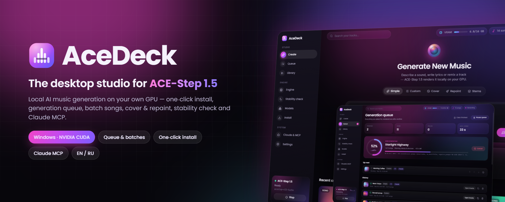

# AceDeck

**The desktop studio & control deck for [ACE-Step 1.5](https://github.com/ace-step/ACE-Step-1.5) — generate full songs with vocals locally on your own GPU.**

One-click install · Generation queue & batches · Cover / Repaint / Stems · Engine control · Stability check · Claude MCP

[](https://github.com/DenisHumen/ace-step-deck/releases/latest)
[](https://github.com/DenisHumen/ace-step-deck/releases)
[](LICENSE)
[](#-system-requirements)
[](https://github.com/ace-step/ACE-Step-1.5)
[](#-control-it-with-claude-mcp)

**English** · [Русский](README.ru.md)

[**⬇ Download for Windows**](https://github.com/DenisHumen/ace-step-deck/releases/latest) &nbsp;·&nbsp; [Features](#-features) &nbsp;·&nbsp; [Screenshots](#-screenshots) &nbsp;·&nbsp; [Claude MCP](#-control-it-with-claude-mcp) &nbsp;·&nbsp; [FAQ](#-faq)

</div>

---

ACE-Step 1.5 is one of the best open music generation models — a local, free alternative to Suno and Udio. But out of the box it is a Python repo, a Gradio page and a REST API. **AceDeck turns it into a real desktop app**: it installs the model and all dependencies with one button, starts/stops/restarts the inference server for you, lets you queue dozens of songs, shows live progress, keeps a searchable library of everything you generated and can even check whether your setup runs stably. Claude can drive all of it through the bundled MCP server.

<div align="center">
  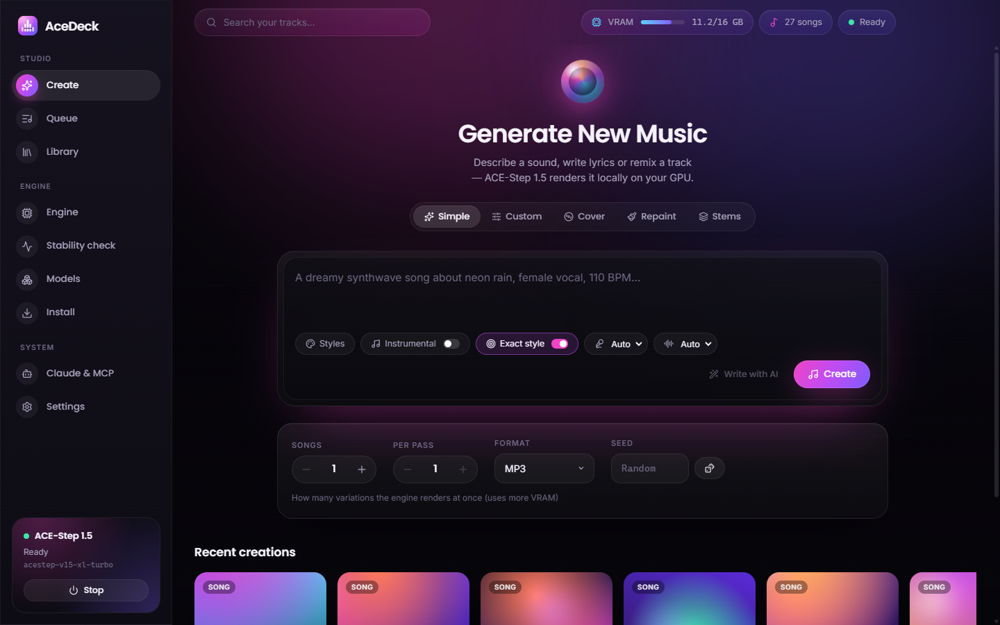
</div>

## ✨ Features

| | |
|---|---|
| 🎹 **Full ACE-Step 1.5 studio** | Simple mode (describe the song, the LM writes caption + lyrics), Custom mode (style tags + lyrics with `[Verse]`/`[Chorus]` helpers), **Cover / remix**, **Repaint** a section, **Stems** (extract / add / complete tracks). Every engine parameter is exposed: duration, BPM, key, time signature, vocal language, DiT & LM model, thinking, steps, guidance, seed, sampler, shift, ADG, CFG interval, LM temperature/CFG/top-k/top-p, negative prompt, output format (MP3/FLAC/WAV/Opus/AAC). |
| ✍️ **AI helpers** | *Write with AI* turns an idea into caption, lyrics, tempo and key; *Enhance* polishes your lyrics; *Surprise me* fills in a random example. |
| 📋 **Generation queue** | Queue any number of jobs, set **how many songs** each job should produce and how many are rendered per pass. Reorder, cancel, retry (resumes where it stopped), duplicate, pause. The queue survives restarts and parks itself if the engine goes down. |
| 📈 **Live progress** | Progress ring with real engine stages (*composing → planning melody → rendering → decoding*), per-pass progress bar, ETA and the engine's live log line. |
| 🎧 **Library & player** | Every song is saved to `Music\AceDeck` with a JSON sidecar (caption, lyrics, seed, BPM, key, model). Grid with generative cover art, search, favorites, waveform player with seeking, **Save as…**, *Show in folder*, *Reuse settings*, *Make a cover*, *Repaint a part*. |
| ⚙️ **Engine control** | Start · Stop · Restart · Update (git pull + uv sync) the ACE-Step API server. Live GPU/VRAM, loaded models, uptime, port, PID and a filtered live log. Attaches to an engine that is already running. |
| 🩺 **Stability check** | 16 checks across system, install, engine and a real **stress test** (several generations with timing, VRAM peak and leak detection) → verdict *Stable / Unstable / Not working*, score and a copyable report. |
| 📦 **One-click installer** | Detects existing installs, or installs everything with progress bars per step: `uv`, ACE-Step source (git or zip), Python 3.12 + PyTorch CUDA 12.8, ~10 GB of models, config and a GPU self-test. Repair mode finishes partial installs. |
| 🧠 **Model manager** | Download extra DiT models (SFT, Base, XL 4B, turbo variants) and LM planners (0.6B / 4B) with progress, pick the defaults. |
| 🤖 **Claude MCP** | 12 MCP tools so Claude Desktop / Claude Code can generate songs, manage the queue, run diagnostics and control the engine. One click adds AceDeck to Claude Desktop. |
| 🔌 **Automation API** | Token-protected local HTTP API (`127.0.0.1`) + `scripts/ctl.mjs` for your own scripts. |
| 🌍 **English & Русский** | Full UI localization with proper plural forms; follows the system language. |

## 📸 Screenshots

<table>
  <tr>
    <td width="50%">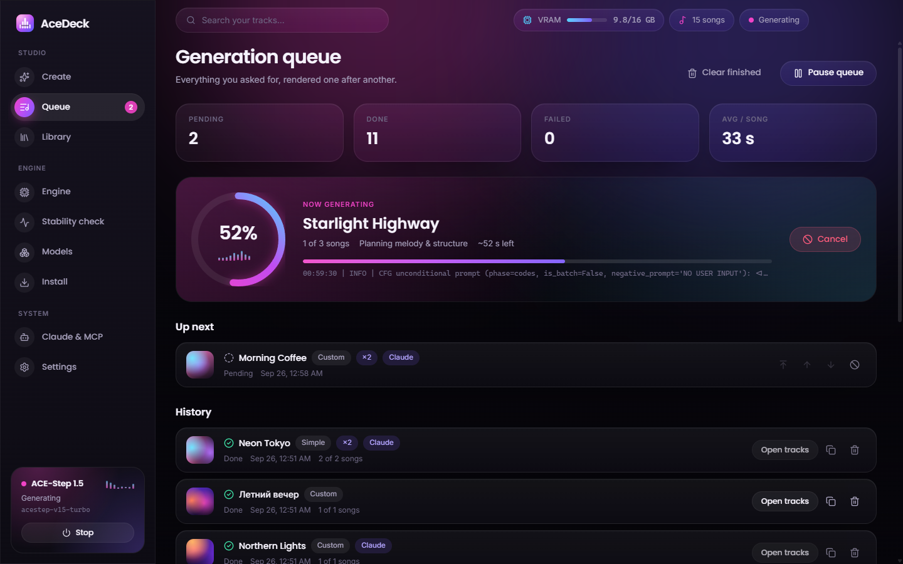<p align="center"><b>Queue</b> — live progress, ETA, batches</p></td>
    <td width="50%">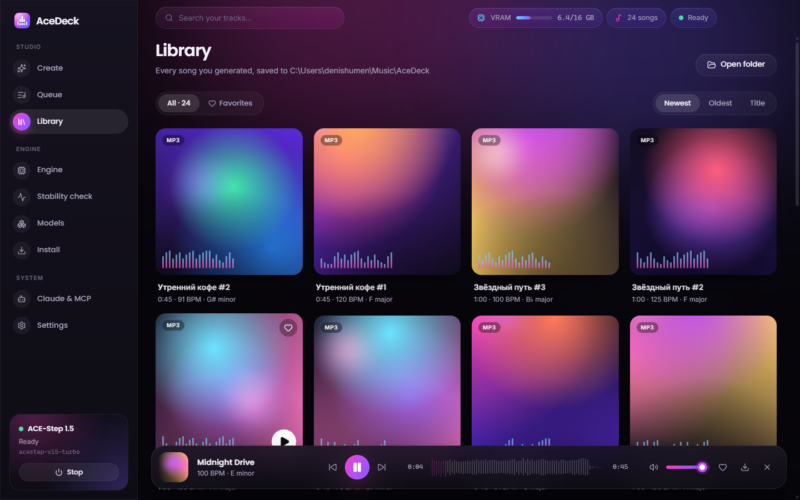<p align="center"><b>Library</b> — generative covers & waveform player</p></td>
  </tr>
  <tr>
    <td>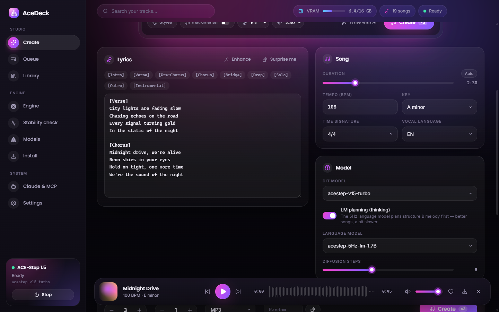<p align="center"><b>Custom mode</b> — lyrics, song & model settings</p></td>
    <td>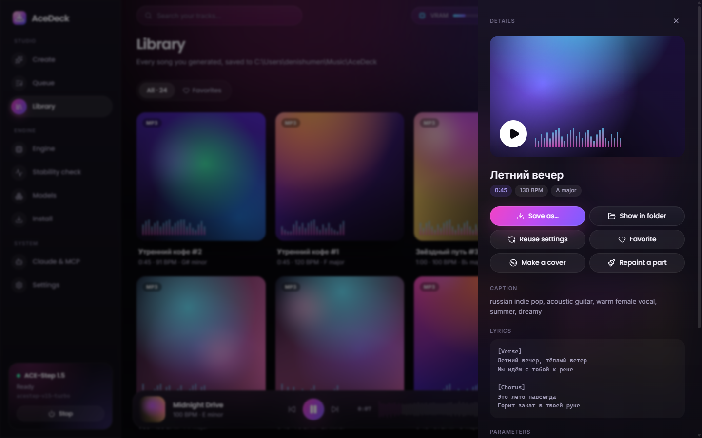<p align="center"><b>Track details</b> — save, reuse, cover, repaint</p></td>
  </tr>
  <tr>
    <td>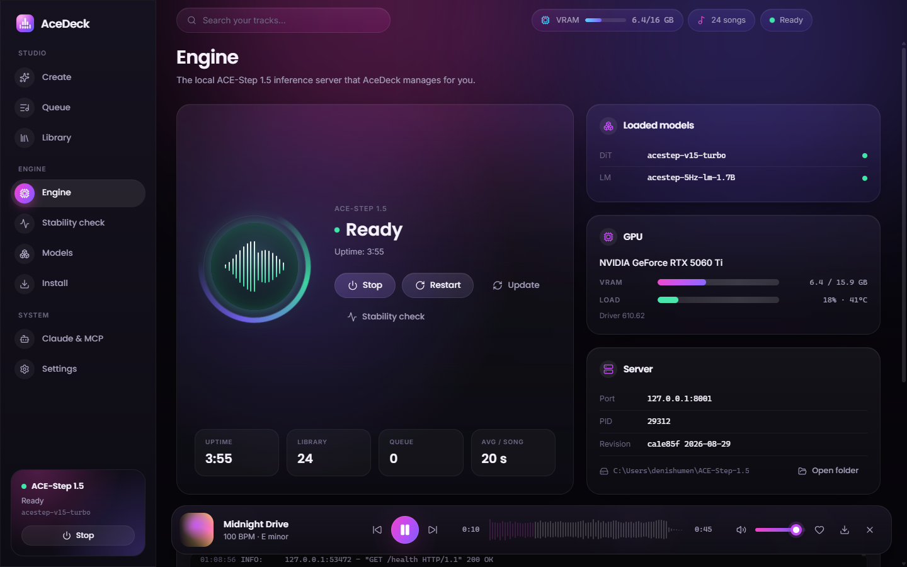<p align="center"><b>Engine</b> — start / stop / restart / update</p></td>
    <td>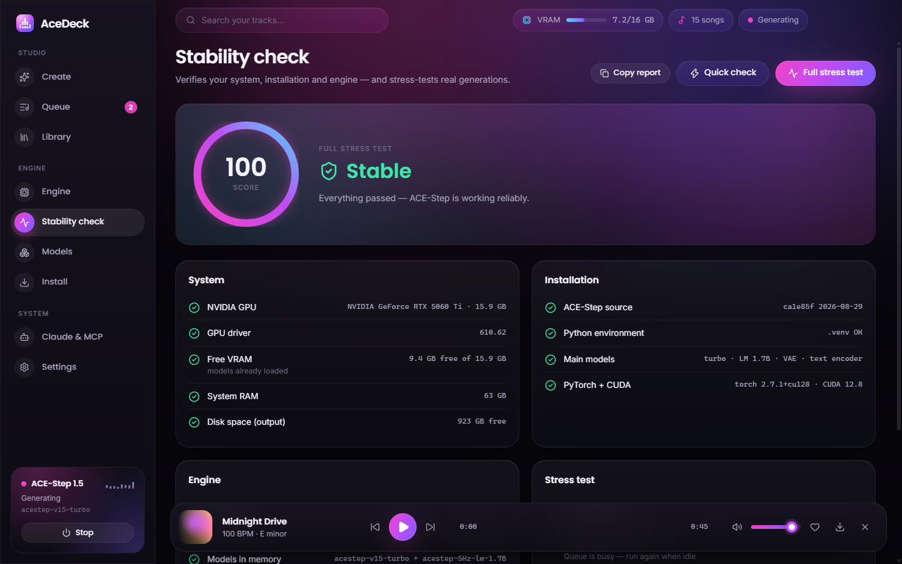<p align="center"><b>Stability check</b> — stress test & verdict</p></td>
  </tr>
  <tr>
    <td>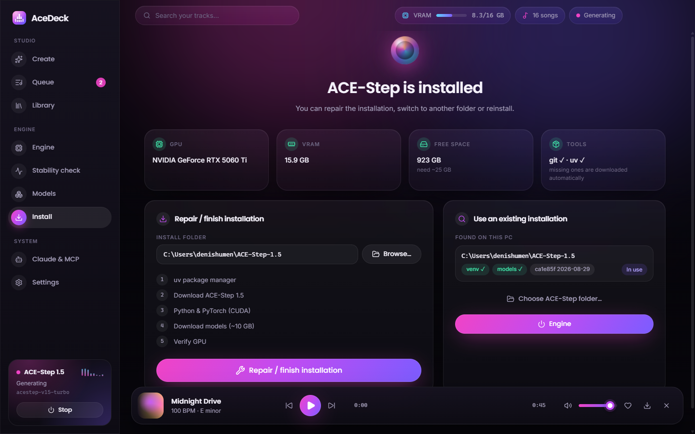<p align="center"><b>Install</b> — one click, or reuse an existing install</p></td>
    <td>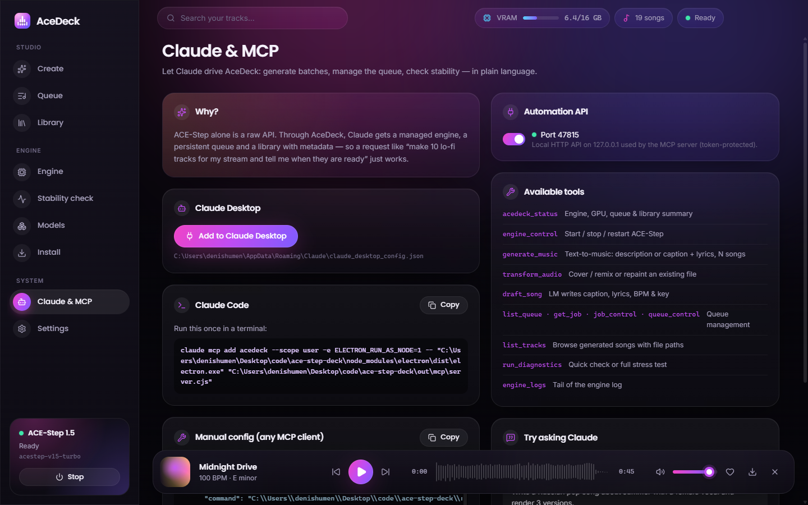<p align="center"><b>Claude & MCP</b> — one-click setup</p></td>
  </tr>
  <tr>
    <td>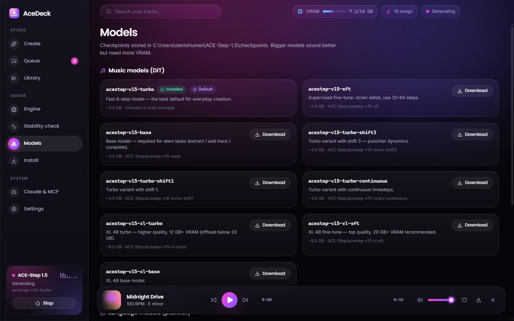<p align="center"><b>Models</b> — download & choose defaults</p></td>
    <td>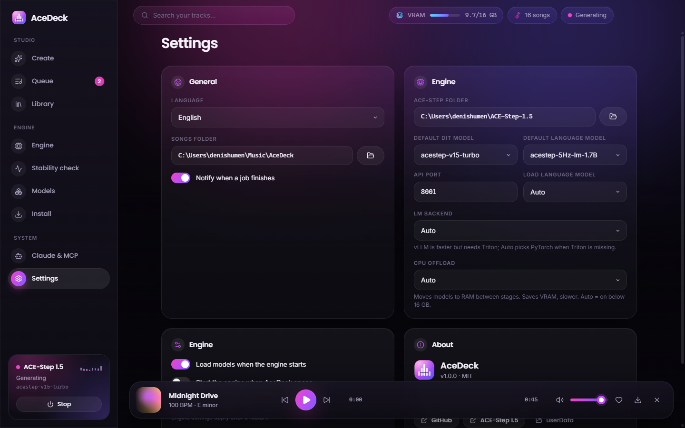<p align="center"><b>Settings</b></p></td>
  </tr>
</table>

## 🚀 Quick start

1. **Download** `AceDeck-Setup-x.y.z.exe` (installer) or `AceDeck-Portable-x.y.z.exe` from [Releases](https://github.com/DenisHumen/ace-step-deck/releases/latest).
2. Run it. Windows SmartScreen may warn because the build is not code-signed → *More info* → *Run anyway*.
3. On first launch AceDeck looks for an existing ACE-Step 1.5 checkout. If none is found, open **Install**, pick a folder and press **Install ACE-Step** — it downloads ~3 GB of Python packages and ~10 GB of models (≈ 5–15 min depending on your connection).
4. Press **Start** in the sidebar, go to **Create**, describe a song and hit **Create**. Songs land in `Music\AceDeck`.

> Already have ACE-Step 1.5? AceDeck auto-detects common locations (e.g. `%USERPROFILE%\ACE-Step-1.5`) or you can point it to any folder in **Install → Use an existing installation**.

## 💻 System requirements

| | Minimum | Recommended |
|---|---|---|
| OS | Windows 10 / 11 x64 | Windows 11 |
| GPU | NVIDIA, 6 GB VRAM (LM disabled) | NVIDIA RTX, 12–16 GB+ VRAM |
| Driver | CUDA 12.8 capable (RTX 50xx needs **570+**) | latest Game Ready / Studio |
| RAM | 16 GB | 32 GB+ |
| Disk | ~25 GB free | SSD |
| Network | first install only (~13 GB) | |

Measured on an **RTX 5060 Ti 16 GB**: engine start + model load ≈ 30 s; a 30-second song with LM planning ≈ 40 s end-to-end; a 15-second instrumental ≈ 10–16 s. Full stress test: *Stable, 100/100*.

## 🤖 Control it with Claude (MCP)

AceDeck ships an [MCP](https://modelcontextprotocol.io) server, so Claude can operate your local music studio in plain language — *“make 10 chill lo-fi instrumentals for my stream, 2 minutes each, and tell me where the files are”*. The MCP server talks to AceDeck (not directly to ACE-Step), so jobs show up in the queue, songs land in the library, and if AceDeck is closed the server launches it automatically.

**Claude Desktop** — open *Claude & MCP* in AceDeck and click **Add to Claude Desktop**, then restart Claude Desktop.

**Claude Code** — copy the command from the same page, it looks like:

```bash
claude mcp add acedeck --scope user -e ELECTRON_RUN_AS_NODE=1 -- "C:\Users\<you>\AppData\Local\Programs\AceDeck\AceDeck.exe" "C:\Users\<you>\AppData\Local\Programs\AceDeck\resources\mcp\server.cjs"
```

No separate Node.js is needed — the AceDeck executable doubles as the Node runtime (`ELECTRON_RUN_AS_NODE=1`).

<details>
<summary><b>Manual config (any MCP client)</b></summary>

```json
{
  "mcpServers": {
    "acedeck": {
      "command": "C:\\Users\\<you>\\AppData\\Local\\Programs\\AceDeck\\AceDeck.exe",
      "args": ["C:\\Users\\<you>\\AppData\\Local\\Programs\\AceDeck\\resources\\mcp\\server.cjs"],
      "env": { "ELECTRON_RUN_AS_NODE": "1" }
    }
  }
}
```
</details>

| Tool | What it does |
|---|---|
| `acedeck_status` | Engine state, GPU/VRAM, queue summary, library size |
| `engine_control` | `start` / `stop` / `restart` the ACE-Step engine |
| `generate_music` | Text-to-music from a description **or** caption + lyrics; `count` songs; waits and returns file paths |
| `transform_audio` | `cover` (remix in a new style) or `repaint` (regenerate a section) of a local audio file |
| `draft_song` | LM writes caption, lyrics, BPM, key and duration — no rendering |
| `list_queue`, `get_job`, `job_control`, `queue_control` | Inspect / cancel / retry jobs, pause / resume / clear the queue |
| `list_tracks` | Browse generated songs with metadata and file paths |
| `run_diagnostics` | Quick check or full stress test with verdict |
| `engine_logs` | Tail of the engine log |

**Is it worth it if Claude could call ACE-Step directly?** ACE-Step's API is stateless: no process management, no persistent queue, no library, no install/repair, and simple mode silently overrides your duration. Through AceDeck, Claude gets a managed engine with the same guarantees as the UI — and you can watch and control everything it does.

## 🔌 Automation API

When enabled (*Claude & MCP → Automation API*), AceDeck listens on `http://127.0.0.1:47815`. The bearer token is written to `%APPDATA%\AceDeck\control.json` on every start.

```bash
node scripts/ctl.mjs GET status
node scripts/ctl.mjs POST engine/start
node scripts/ctl.mjs POST jobs '{"params":{"prompt":"lo-fi, rhodes, rain","instrumental":true,"audio_duration":60},"count":5,"batchSize":1}'
node scripts/ctl.mjs GET jobs
node scripts/ctl.mjs GET "tracks?limit=10"
node scripts/ctl.mjs POST diagnostics/run '{"mode":"full"}'
```

Endpoints: `GET /status` · `POST /engine/{start|stop|restart}` · `GET /engine/logs` · `GET|POST /jobs` · `GET /jobs/:id` · `POST /jobs/:id/{cancel|retry}` · `POST /queue/{pause|resume|clear}` · `GET /tracks` · `GET /tracks/:id` · `GET /diagnostics` · `POST /diagnostics/run` · `GET /models` · `POST /models/:name/download` · `POST /ai/sample`. Job `params` accept any field of the ACE-Step `/release_task` body.

## 🛠 Build from source

```bash
git clone https://github.com/DenisHumen/ace-step-deck.git
cd ace-step-deck
npm install
node node_modules/electron/install.js   # Electron 44 downloads its binary on demand
npm run dev                              # Vite + esbuild watch + Electron
npm test                                 # unit tests (vitest)
node tests/e2e.mjs                       # end-to-end suite against the real engine (needs `npm run dev`)
npm run dist                             # typecheck + build + NSIS installer & portable exe → release/
```

```
src/
├─ main/        Electron main: engine manager, installer, queue, library, diagnostics, models, automation API
├─ preload/     contextBridge IPC
├─ renderer/    React 19 + Tailwind 4 UI (pages, components, i18n en/ru)
├─ mcp/         MCP server (bundled to out/mcp/server.cjs)
└─ shared/      types, constants, pure logic shared by all of the above
scripts/        dev runner, esbuild build, icons, screenshots, ctl.mjs
tests/          vitest unit tests + MCP smoke test
```

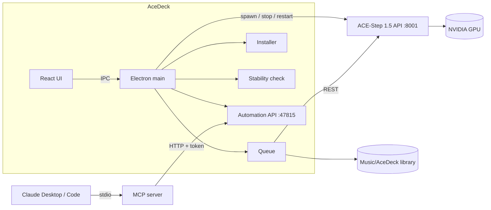

## ❓ FAQ

<details><summary><b>Windows SmartScreen blocks the installer</b></summary>
The builds are not code-signed yet. Click <i>More info → Run anyway</i>, or build from source.
</details>

<details><summary><b>“vLLM backend is unavailable on Windows because Triton is not installed”</b></summary>
Harmless. AceDeck automatically uses the PyTorch backend for the language model when Triton is missing (Settings → LM backend).
</details>

<details><summary><b>Generation is slower than expected on a 16 GB card</b></summary>
ACE-Step enables CPU offload below 16 GB and many 16 GB cards report 15.9 GB. Settings → CPU offload → <i>Off</i> keeps everything in VRAM (~1.5× faster in our test, peak ≈ 15 GB) — switch back to <i>Auto</i> if you hit out-of-memory on long songs.
</details>

<details><summary><b>Simple mode ignores my duration in the official UI</b></summary>
ACE-Step's own sample mode overwrites duration/BPM/key with the LM's choice. AceDeck composes first (<code>/v1/create_sample</code>) and then renders with your settings, so the duration you pick is respected.
</details>

<details><summary><b>Hugging Face is blocked in my country</b></summary>
The ACE-Step downloader automatically falls back to ModelScope.
</details>

<details><summary><b>Port 8001 is already used</b></summary>
Change the API port in Settings. If another ACE-Step server is already running on that port, AceDeck simply attaches to it.
</details>

<details><summary><b>How do I uninstall?</b></summary>
Use “Add or remove programs”. The ACE-Step folder (with ~17 GB of Python packages and models) is yours — delete it manually if you no longer need it. Songs stay in <code>Music\AceDeck</code>.
</details>

## 🗺 Roadmap

- [ ] macOS (Apple Silicon / MLX) and Linux builds
- [ ] LoRA training UI
- [ ] Code signing & auto-update
- [ ] Playlists, tags and export to DAW stems
- [ ] Multi-GPU / multi-slot model switching

## 🙏 Credits

- [ACE-Step 1.5](https://github.com/ace-step/ACE-Step-1.5) by the ACE-Step team — the model and inference server that make all of this possible.
- Design inspired by Dribbble/Pinterest concepts: the “ElevMuse — AI music generator” dashboard and the “AI Mastering Engine” status panel.
- Built with [Electron](https://www.electronjs.org), [React](https://react.dev), [Tailwind CSS](https://tailwindcss.com), [wavesurfer.js](https://wavesurfer.xyz), [Lucide](https://lucide.dev), [Motion](https://motion.dev) and the [MCP TypeScript SDK](https://github.com/modelcontextprotocol/typescript-sdk).

## 📄 License

[MIT](LICENSE) © 2026 DenisHumen. AceDeck is an independent project and is not affiliated with the ACE-Step team. Generated music is subject to the ACE-Step model license and your local laws.

<div align="center"><sub>If AceDeck saves you time, a ⭐ helps other people find it.</sub></div>
