<div align="center">

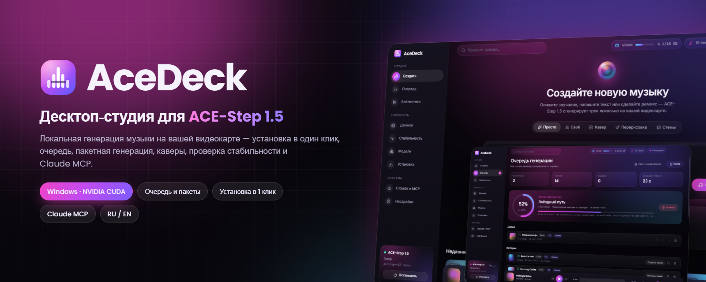

# AceDeck

**Десктоп-студия и пульт управления для [ACE-Step 1.5](https://github.com/ace-step/ACE-Step-1.5): генерируйте полноценные песни с вокалом локально на своей видеокарте.**

Установка в один клик · Очередь и пакетная генерация · Каверы, перерисовка, стемы · Управление нейросетью · Проверка стабильности · Claude MCP

[](https://github.com/DenisHumen/ace-step-deck/releases/latest)
[](https://github.com/DenisHumen/ace-step-deck/releases)
[](LICENSE)
[](#-системные-требования)
[](https://github.com/ace-step/ACE-Step-1.5)
[](#-управление-через-claude-mcp)

[English](README.md) · **Русский**

[**⬇ Скачать для Windows**](https://github.com/DenisHumen/ace-step-deck/releases/latest) &nbsp;·&nbsp; [Возможности](#-возможности) &nbsp;·&nbsp; [Скриншоты](#-скриншоты) &nbsp;·&nbsp; [Claude MCP](#-управление-через-claude-mcp) &nbsp;·&nbsp; [FAQ](#-частые-вопросы)

</div>

---

ACE-Step 1.5 — одна из лучших открытых моделей для генерации музыки, бесплатная локальная альтернатива Suno и Udio. Но «из коробки» это Python-репозиторий, страница Gradio и REST API. **AceDeck превращает её в полноценное приложение**:

- ставит модель и все зависимости одной кнопкой;
- сам запускает, останавливает и перезапускает сервер нейросети;
- позволяет ставить в очередь десятки песен и показывает живой прогресс;
- хранит библиотеку всего сгенерированного с поиском;
- проверяет, стабильно ли работает ваша связка.

Всем этим может управлять и Claude через встроенный MCP-сервер.

<div align="center">
  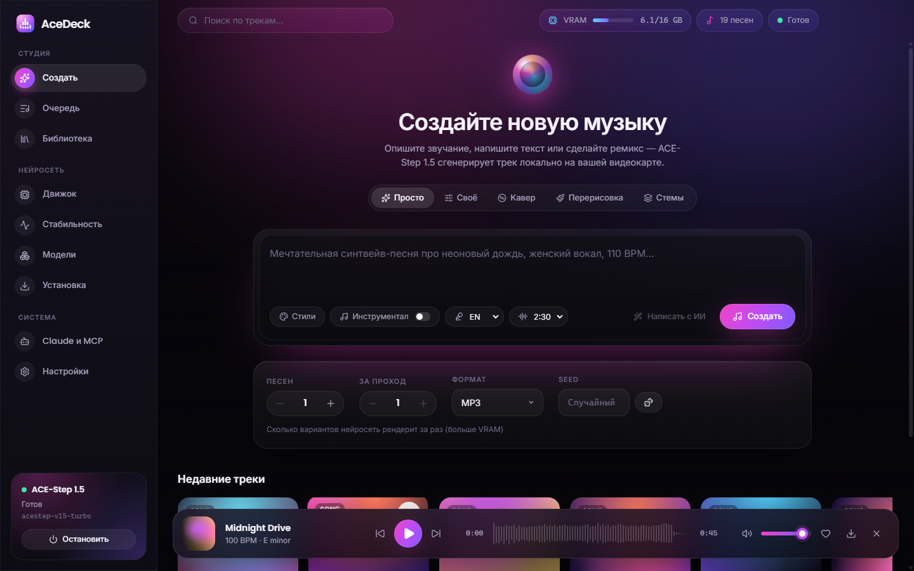
</div>

## ✨ Возможности

| | |
|---|---|
| 🎹 **Полная студия ACE-Step 1.5** | Режимы:<br>• «Просто» — опишите песню, LM сама напишет стиль и текст;<br>• «Своё» — теги стиля и текст с кнопками `[Verse]`/`[Chorus]`;<br>• **Кавер / ремикс**;<br>• **Перерисовка** фрагмента;<br>• **Стемы** — выделить, добавить или дописать дорожки.<br>Доступны все параметры движка: длительность, BPM, тональность, размер, язык вокала, модели DiT и LM, thinking, шаги, guidance, seed, сэмплер, shift, ADG, интервал CFG, параметры LM (temperature, CFG, top-k, top-p), негативный промпт, формат (MP3/FLAC/WAV/Opus/AAC). |
| ✍️ **ИИ-помощники** | «Написать с ИИ» превращает идею в описание стиля, текст, темп и тональность. «Улучшить» дорабатывает текст. «Удиви меня» подставляет случайный пример. |
| 📋 **Очередь генерации** | Ставьте сколько угодно задач и задавайте, **сколько песен** сделать в каждой и сколько рендерить за проход. Задачи можно переставлять, отменять, повторять (с места остановки), дублировать, ставить на паузу. Очередь переживает перезапуск и сама встаёт на паузу, если нейросеть упала. |
| 📈 **Живой прогресс** | Кольцо прогресса с реальными этапами (*сочинение → планирование мелодии → рендер → декодирование*), полоса текущего прохода, ETA и строка журнала нейросети. |
| 🎧 **Библиотека и плеер** | Каждая песня сохраняется в `Музыка\AceDeck` вместе с JSON-файлом (описание, текст, seed, BPM, тональность, модель). В библиотеке:<br>• сетка с генеративными обложками, поиск и избранное;<br>• плеер с волновой формой и перемоткой;<br>• «Сохранить как…», «Показать в папке», «Повторить настройки», «Сделать кавер», «Перерисовать часть». |
| ⚙️ **Управление нейросетью** | Запуск, остановка, перезапуск и обновление (git pull + uv sync) сервера ACE-Step. Показывает GPU и VRAM в реальном времени, загруженные модели, время работы, порт, PID и отфильтрованный живой журнал. Умеет подключаться к уже запущенному серверу. |
| 🩺 **Проверка стабильности** | 16 проверок: система, установка, сервер и настоящий **стресс-тест** (несколько генераций с замером времени, пика VRAM и поиском утечек). Итог — вердикт «Стабильно / Нестабильно / Не работает», оценка и отчёт, который можно скопировать. |
| 📦 **Установка в один клик** | Находит готовые установки или ставит всё сам, с прогресс-баром по каждому шагу: `uv`, исходники ACE-Step (git или zip), Python 3.12 + PyTorch CUDA 12.8, ~10 ГБ моделей, настройка и самопроверка GPU. Режим «Восстановить» доставляет недостающее. |
| 🧠 **Менеджер моделей** | Скачивание дополнительных DiT-моделей (SFT, Base, XL 4B, варианты turbo) и LM-планировщиков (0.6B / 4B) с прогрессом, выбор моделей по умолчанию. |
| 🤖 **Claude MCP** | 12 MCP-инструментов: Claude Desktop и Claude Code генерируют песни, управляют очередью, запускают проверку и управляют нейросетью. Подключение к Claude Desktop — одной кнопкой. |
| 🔌 **API автоматизации** | Локальный HTTP API (`127.0.0.1`) с токеном и утилита `scripts/ctl.mjs` для ваших скриптов. |
| 🌍 **Русский и English** | Полная локализация интерфейса с правильными склонениями («1 песня / 2 песни / 5 песен»). Язык выбирается по системе. |

## 📸 Скриншоты

<table>
  <tr>
    <td width="50%">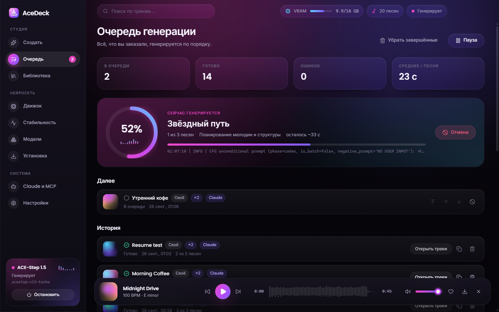<p align="center"><b>Очередь</b> — живой прогресс, ETA, серии</p></td>
    <td width="50%">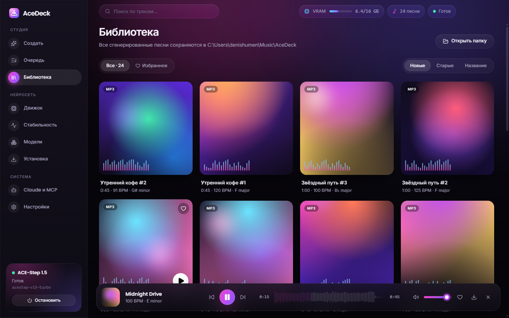<p align="center"><b>Библиотека</b> — обложки и плеер с волной</p></td>
  </tr>
  <tr>
    <td>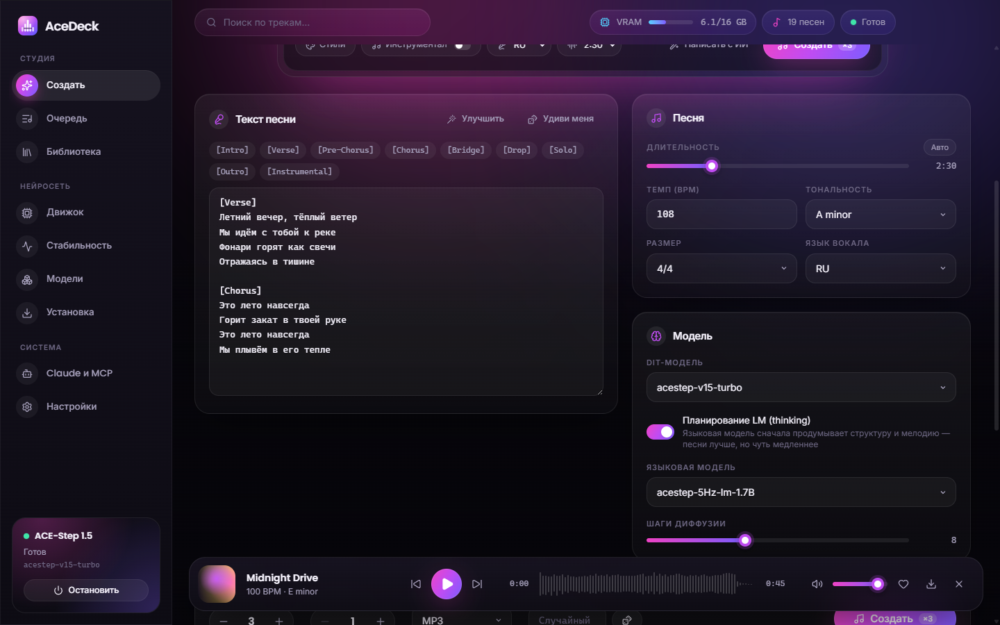<p align="center"><b>Режим «Своё»</b> — текст, параметры песни и модели</p></td>
    <td>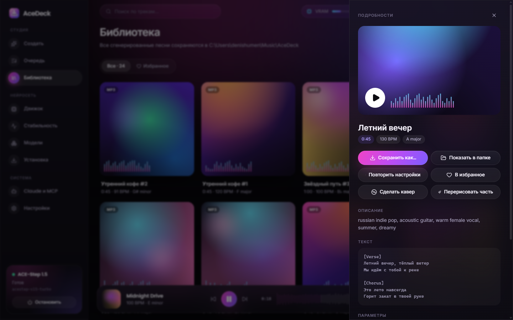<p align="center"><b>Карточка трека</b> — сохранить, повторить, кавер</p></td>
  </tr>
  <tr>
    <td>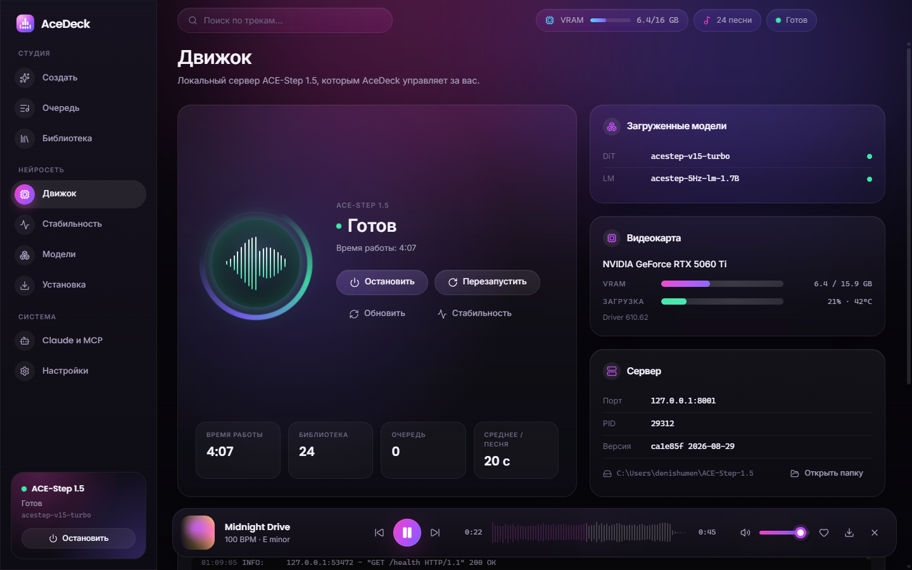<p align="center"><b>Движок</b> — запуск / стоп / перезапуск / обновление</p></td>
    <td>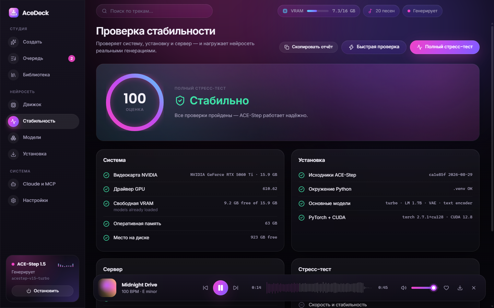<p align="center"><b>Стабильность</b> — стресс-тест и вердикт</p></td>
  </tr>
  <tr>
    <td>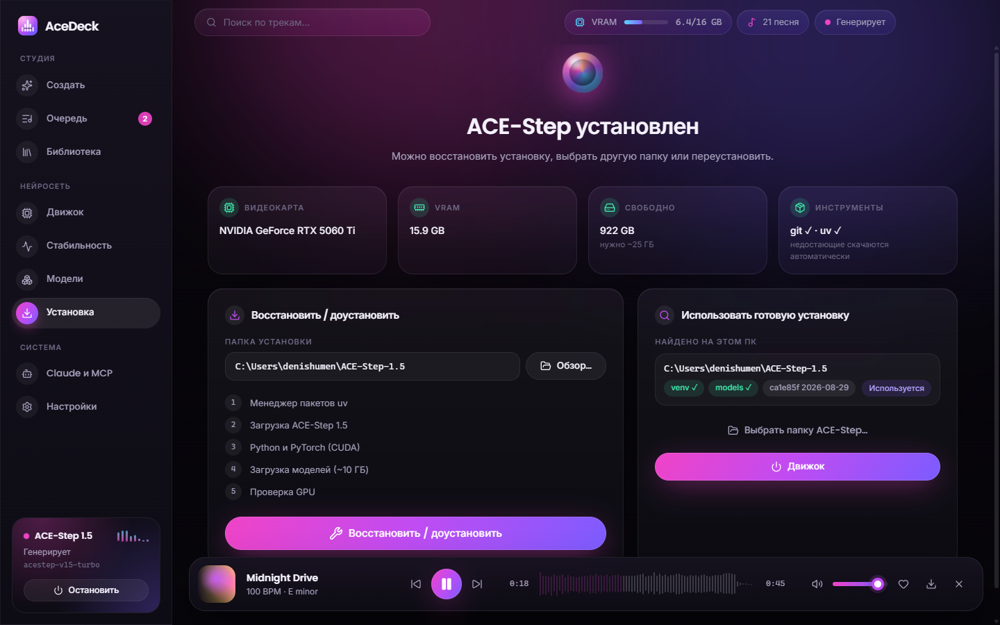<p align="center"><b>Установка</b> — один клик или готовая установка</p></td>
    <td>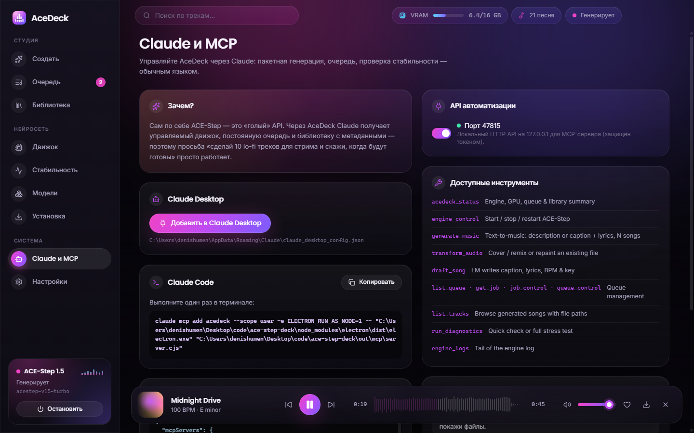<p align="center"><b>Claude и MCP</b> — настройка в один клик</p></td>
  </tr>
  <tr>
    <td>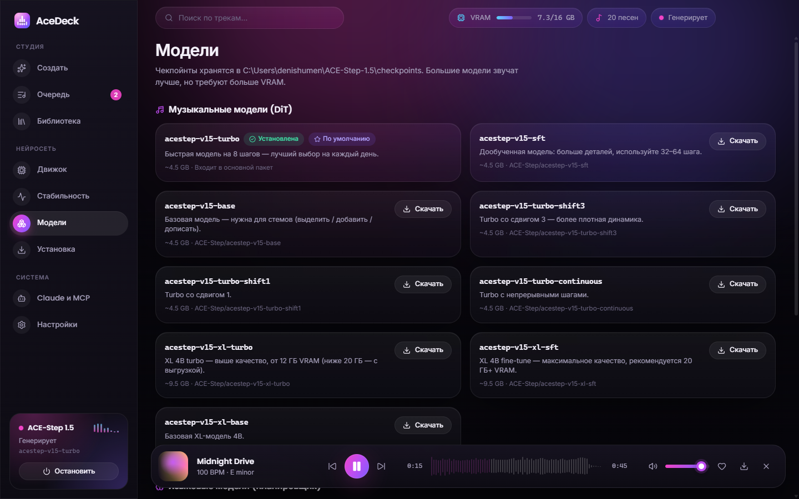<p align="center"><b>Модели</b> — загрузка и выбор по умолчанию</p></td>
    <td>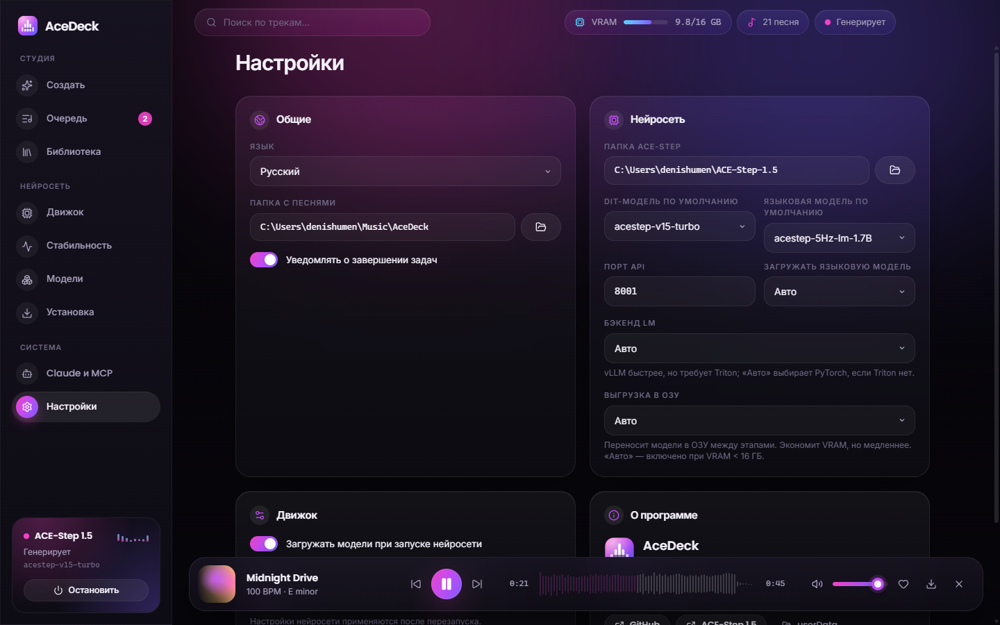<p align="center"><b>Настройки</b></p></td>
  </tr>
</table>

## 🚀 Быстрый старт

1. **Скачайте** `AceDeck-Setup-x.y.z.exe` (установщик) или `AceDeck-Portable-x.y.z.exe` со страницы [Releases](https://github.com/DenisHumen/ace-step-deck/releases/latest).
2. Запустите. Windows SmartScreen может предупредить, что сборка не подписана: нажмите «Подробнее» → «Выполнить в любом случае».
3. При первом запуске AceDeck ищет существующую установку ACE-Step 1.5. Если её нет, откройте «Установка», выберите папку и нажмите «Установить ACE-Step». Скачается ~3 ГБ Python-пакетов и ~10 ГБ моделей, это займёт около 5–15 минут в зависимости от интернета.
4. Нажмите «Запустить» в боковой панели, откройте «Создать», опишите песню и нажмите «Создать». Песни сохраняются в `Музыка\AceDeck`.

> ACE-Step 1.5 уже установлен? AceDeck сам находит типичные папки (например, `%USERPROFILE%\ACE-Step-1.5`). Любую другую папку можно выбрать в «Установка» → «Использовать готовую установку».

## 💻 Системные требования

| | Минимум | Рекомендуется |
|---|---|---|
| ОС | Windows 10 / 11 x64 | Windows 11 |
| Видеокарта | NVIDIA, 6 ГБ VRAM (без LM) | NVIDIA RTX, 12–16 ГБ+ VRAM |
| Драйвер | с поддержкой CUDA 12.8 (для RTX 50xx — **570+**) | последний Game Ready / Studio |
| ОЗУ | 16 ГБ | 32 ГБ+ |
| Диск | ~25 ГБ свободно | SSD |
| Интернет | только для первой установки (~13 ГБ) | |

Замеры на **RTX 5060 Ti 16 ГБ**:

| Операция | Время |
|---|---|
| Запуск нейросети и загрузка моделей | ≈ 30 с |
| 30-секундная песня с планированием LM (от начала до конца) | ≈ 40 с |
| 15-секундный инструментал | ≈ 10–16 с |

Полный стресс-тест: «Стабильно, 100/100».

## 🤖 Управление через Claude (MCP)

В AceDeck встроен [MCP](https://modelcontextprotocol.io)-сервер, поэтому Claude может работать с вашей локальной студией обычным языком. Например: «сделай 10 спокойных lo-fi инструменталов по 2 минуты для стрима и скажи, где лежат файлы».

MCP-сервер обращается к AceDeck, а не напрямую к ACE-Step. Поэтому задачи видны в очереди, песни попадают в библиотеку, а если AceDeck закрыт, сервер сам его запустит.

**Claude Desktop.** Откройте в AceDeck «Claude и MCP», нажмите «Добавить в Claude Desktop» и перезапустите Claude Desktop.

**Claude Code.** Скопируйте команду с той же страницы. Она выглядит так:

```bash
claude mcp add acedeck --scope user -e ELECTRON_RUN_AS_NODE=1 -- "C:\Users\<вы>\AppData\Local\Programs\AceDeck\AceDeck.exe" "C:\Users\<вы>\AppData\Local\Programs\AceDeck\resources\mcp\server.cjs"
```

Отдельный Node.js не нужен: `AceDeck.exe` сам работает как среда Node (`ELECTRON_RUN_AS_NODE=1`).

<details>
<summary><b>Ручная настройка (любой MCP-клиент)</b></summary>

```json
{
  "mcpServers": {
    "acedeck": {
      "command": "C:\\Users\\<вы>\\AppData\\Local\\Programs\\AceDeck\\AceDeck.exe",
      "args": ["C:\\Users\\<вы>\\AppData\\Local\\Programs\\AceDeck\\resources\\mcp\\server.cjs"],
      "env": { "ELECTRON_RUN_AS_NODE": "1" }
    }
  }
}
```
</details>

| Инструмент | Что делает |
|---|---|
| `acedeck_status` | Состояние нейросети, GPU/VRAM, сводка очереди, размер библиотеки |
| `engine_control` | `start` / `stop` / `restart` нейросети ACE-Step |
| `generate_music` | Генерация по описанию **или** по стилю и тексту; `count` песен; ждёт и возвращает пути к файлам |
| `transform_audio` | `cover` (ремикс в новом стиле) или `repaint` (перерисовка фрагмента) локального файла |
| `draft_song` | LM пишет описание, текст, BPM, тональность и длительность, без рендера |
| `list_queue`, `get_job`, `job_control`, `queue_control` | Просмотр, отмена и повтор задач; пауза, продолжение и очистка очереди |
| `list_tracks` | Библиотека песен с метаданными и путями |
| `run_diagnostics` | Быстрая проверка или полный стресс-тест с вердиктом |
| `engine_logs` | Хвост журнала нейросети |

**Зачем это, если Claude может вызывать ACE-Step напрямую?** API ACE-Step не хранит состояние. В нём нет управления процессом, постоянной очереди, библиотеки, установки и восстановления, а «простой режим» молча игнорирует выбранную длительность. Через AceDeck Claude получает управляемую нейросеть с теми же гарантиями, что и интерфейс, а вы видите и контролируете всё, что он делает.

## 🔌 API автоматизации

Если API включён («Claude и MCP» → «API автоматизации»), AceDeck слушает `http://127.0.0.1:47815`. Токен записывается в `%APPDATA%\AceDeck\control.json` при каждом запуске.

```bash
node scripts/ctl.mjs GET status
node scripts/ctl.mjs POST engine/start
node scripts/ctl.mjs POST jobs '{"params":{"prompt":"lo-fi, rhodes, rain","instrumental":true,"audio_duration":60},"count":5,"batchSize":1}'
node scripts/ctl.mjs GET jobs
node scripts/ctl.mjs GET "tracks?limit=10"
node scripts/ctl.mjs POST diagnostics/run '{"mode":"full"}'
```

Эндпоинты: `GET /status` · `POST /engine/{start|stop|restart}` · `GET /engine/logs` · `GET|POST /jobs` · `GET /jobs/:id` · `POST /jobs/:id/{cancel|retry}` · `POST /queue/{pause|resume|clear}` · `GET /tracks` · `GET /tracks/:id` · `GET /diagnostics` · `POST /diagnostics/run` · `GET /models` · `POST /models/:name/download` · `POST /ai/sample`. В `params` задачи можно передать любое поле тела `/release_task` из ACE-Step.

## 🛠 Сборка из исходников

```bash
git clone https://github.com/DenisHumen/ace-step-deck.git
cd ace-step-deck
npm install
node node_modules/electron/install.js   # Electron 44 скачивает бинарник по запросу
npm run dev                              # Vite + esbuild watch + Electron
npm test                                 # юнит-тесты (vitest)
npm run dist                             # проверка типов + сборка + NSIS-установщик и portable → release/
```

```
src/
├─ main/        процесс Electron: менеджер нейросети, установщик, очередь, библиотека, проверка, модели, API
├─ preload/     IPC через contextBridge
├─ renderer/    интерфейс на React 19 + Tailwind 4 (страницы, компоненты, i18n en/ru)
├─ mcp/         MCP-сервер (собирается в out/mcp/server.cjs)
└─ shared/      типы, константы и общая логика
scripts/        dev-запуск, сборка esbuild, иконки, скриншоты, ctl.mjs
tests/          юнит-тесты vitest + smoke-тест MCP
```

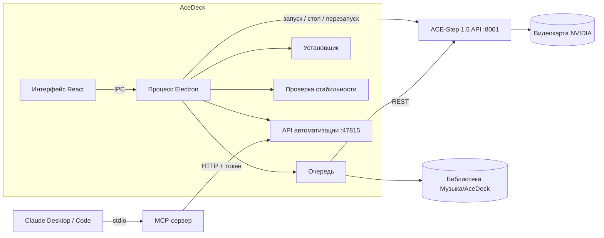

## ❓ Частые вопросы

<details><summary><b>Windows SmartScreen блокирует установщик</b></summary>
Сборки пока не подписаны сертификатом. Нажмите «Подробнее» → «Выполнить в любом случае» или соберите приложение из исходников.
</details>

<details><summary><b>«vLLM backend is unavailable on Windows because Triton is not installed»</b></summary>
Это не ошибка. Если Triton нет, AceDeck автоматически использует для языковой модели бэкенд PyTorch (Настройки → Бэкенд LM).
</details>

<details><summary><b>Генерация медленнее, чем ожидалось, на карте 16 ГБ</b></summary>
ACE-Step включает выгрузку в ОЗУ при VRAM меньше 16 ГБ, а многие карты на 16 ГБ показывают 15,9 ГБ. «Настройки» → «Выгрузка в ОЗУ» → «Выкл» держит всё в видеопамяти: в нашем тесте это ~1,5× быстрее, пик ≈ 15 ГБ. Если на длинных песнях не хватит памяти, верните «Авто».
</details>

<details><summary><b>В официальном интерфейсе «простой режим» игнорирует длительность</b></summary>
Собственный sample mode в ACE-Step подменяет длительность, BPM и тональность выбором LM. AceDeck сначала сочиняет песню (<code>/v1/create_sample</code>), а потом рендерит её с вашими настройками, поэтому выбранная длительность соблюдается.
</details>

<details><summary><b>Hugging Face заблокирован в моей стране</b></summary>
Загрузчик ACE-Step автоматически переключается на ModelScope.
</details>

<details><summary><b>Порт 8001 уже занят</b></summary>
Смените порт API в настройках. Если на этом порту уже работает другой сервер ACE-Step, AceDeck просто подключится к нему.
</details>

<details><summary><b>Как удалить?</b></summary>
Через «Установка и удаление программ». Папка ACE-Step (~17 ГБ пакетов и моделей) остаётся вашей: удалите её вручную, если она больше не нужна. Песни остаются в <code>Музыка\AceDeck</code>.
</details>

## 🗺 Планы

- [ ] Сборки для macOS (Apple Silicon / MLX) и Linux
- [ ] Интерфейс обучения LoRA
- [ ] Подпись кода и автообновление
- [ ] Плейлисты, теги и экспорт стемов в DAW
- [ ] Несколько GPU и слотов моделей

## 🙏 Благодарности

- [ACE-Step 1.5](https://github.com/ace-step/ACE-Step-1.5) от команды ACE-Step — модель и сервер, без которых ничего бы не было.
- Дизайн вдохновлён концептами с Dribbble/Pinterest: дашбордом «ElevMuse — AI music generator» и панелью статуса «AI Mastering Engine».
- Сделано на [Electron](https://www.electronjs.org), [React](https://react.dev), [Tailwind CSS](https://tailwindcss.com), [wavesurfer.js](https://wavesurfer.xyz), [Lucide](https://lucide.dev), [Motion](https://motion.dev) и [MCP TypeScript SDK](https://github.com/modelcontextprotocol/typescript-sdk).

## 📄 Лицензия

[MIT](LICENSE) © 2026 DenisHumen. AceDeck — независимый проект, не связанный с командой ACE-Step. Сгенерированная музыка подчиняется лицензии моделей ACE-Step и законам вашей страны.

<div align="center"><sub>Если AceDeck экономит вам время, поставьте ⭐ — так проект найдут другие.</sub></div>
